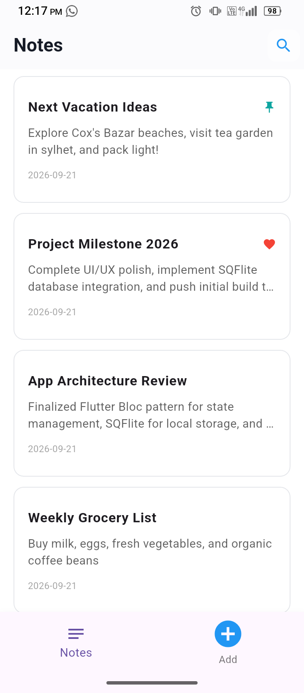
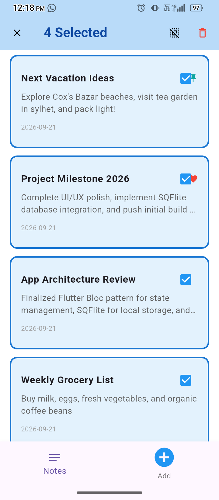
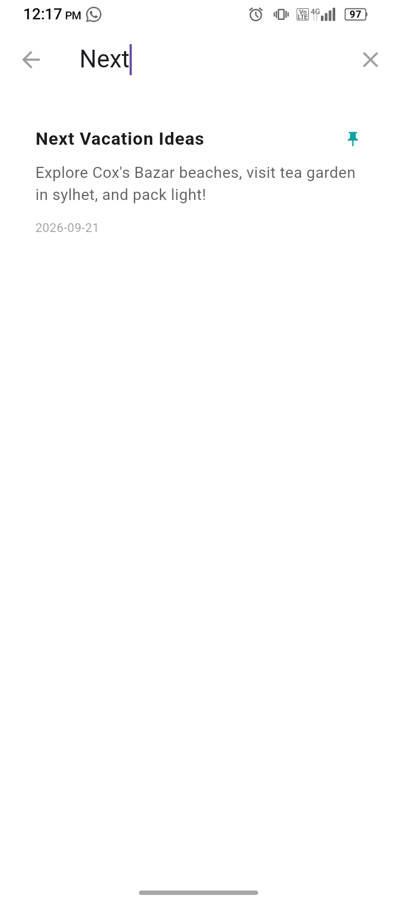
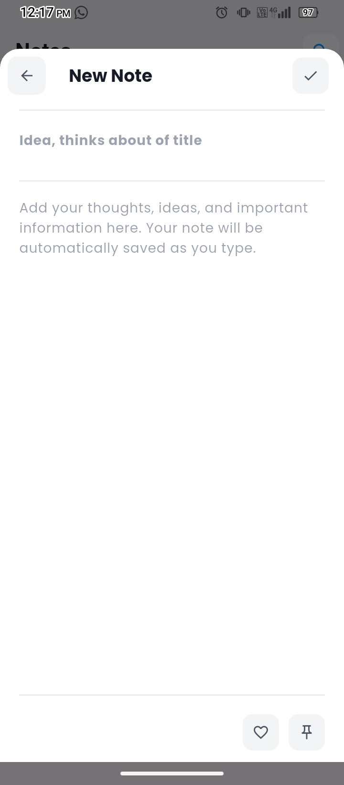
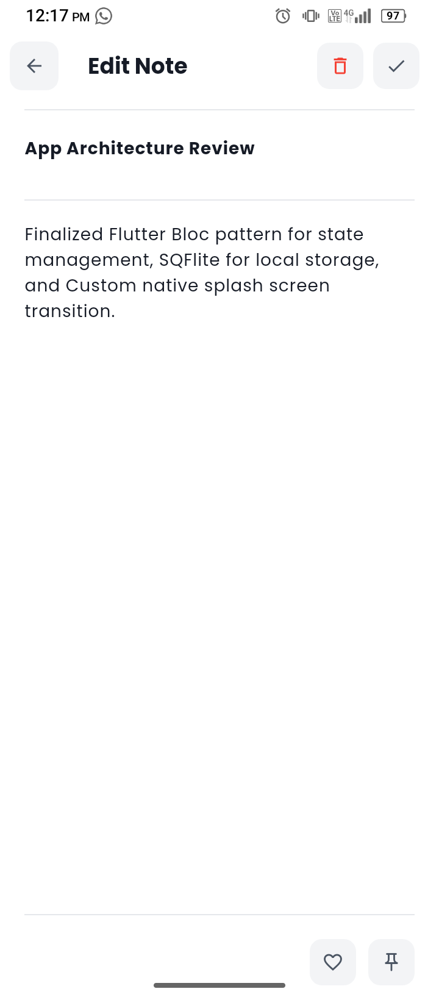
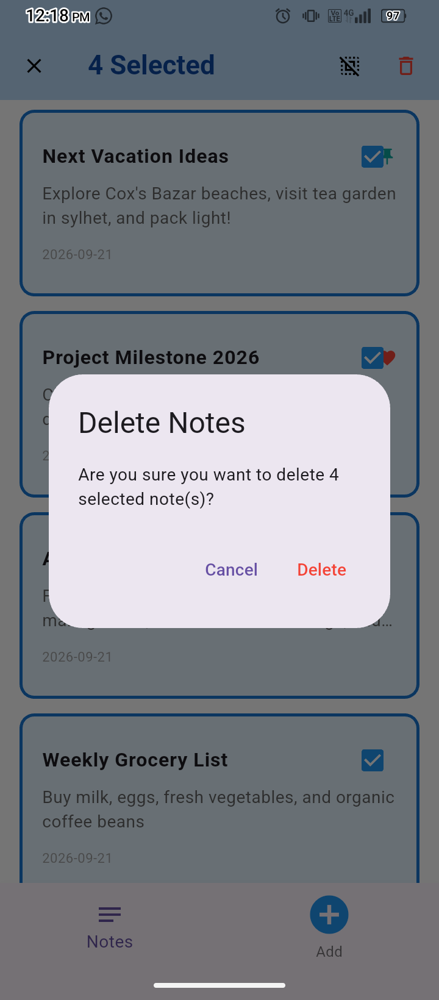
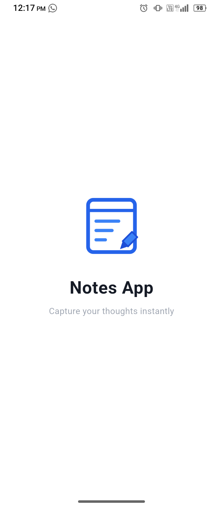
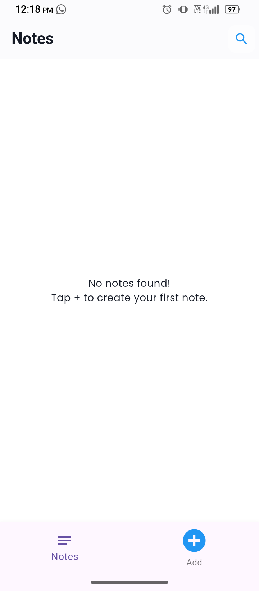

# 📝 Note Taking App (Flutter & BLoC)

A feature-rich, high-performance offline note-taking application built using **Flutter**, state management powered by **BLoC Pattern**, and local persistent storage using **SQFlite (SQLite Database)**.

---

## 🛡️ Badges & Tech Stack

[](https://flutter.dev)
[](https://dart.dev)
[](https://pub.dev/packages/flutter_bloc)
[](https://pub.dev/packages/sqflite)
[](https://pub.dev/packages/equatable)
[](https://pub.dev/packages/shared_preferences)
[](https://pub.dev/packages/google_fonts)
[](https://pub.dev/packages/intl)
[](https://pub.dev/packages/uuid)
[](https://flutter.dev)

---

## ✨ Features

- 📝 **Create, Edit & Delete Notes:** Fast and intuitive interface to manage daily notes seamlessly.
- 🔍 **Real-time Search:** Built-in `SearchDelegate` for instant keyword searching across saved notes.
- 🎨 **Rich UI & Custom Bottom Sheets:** Seamless user interface flow with smooth dynamic bottom sheet integration.
- 🔘 **Multi-Selection Mode:** Select multiple items directly from the dashboard for batch actions.
- ⚡ **BLoC State Management:** Decoupled business logic with `flutter_bloc` & `equatable` ensuring reactive and clean code flow.
- 💾 **Local Offline Storage:** Full SQLite database support via `sqflite` for reliable offline data persistence.
- 📱 **Cross-Platform Ready:** Native support for Android, iOS, macOS, Windows, Linux, and Web.

---

## 📸 Screenshots & UI Showcase

| Dashboard Screen | Multi-Selection Mode | Search Delegate |
| :---: | :---: | :---: |
|  |  |  |

| New Note Sheet | Edit Note Screen | Delete Pop-up |
| :---: | :---: | :---: |
|  |  |  |

| Native Splash | Custom Splash Screen | Empty State |
| :---: | :---: | :---: |
|  |  |  |

---

## 📁 Project Directory Structure

```text
lib/
├── controllers/
│   └── note_form_controller.dart
├── core/
│   ├── bloc/
│   │   ├── bottom_navigation_navbar/
│   │   │   ├── nav_bloc.dart
│   │   │   ├── nav_event.dart
│   │   │   └── nav_state.dart
│   │   ├── note/
│   │   │   ├── note_bloc.dart
│   │   │   ├── note_event.dart
│   │   │   └── note_state.dart
│   │   └── app_bloc_providers.dart
│   ├── database/
│   │   ├── database_helper.dart
│   │   └── note_model.dart
│   └── widgets/
│       ├── app_button.dart
│       ├── app_icon_button.dart
│       ├── app_text.dart
│       ├── app_text_field.dart
│       ├── app_theme.dart
│       ├── custom_app_bar.dart
│       ├── note_search_delegate.dart
│       └── note_sheet_helper.dart
├── features/
│   ├── home_screen/
│   │   ├── widgets/
│   │   │   └── note_card.dart
│   │   └── home_screen.dart
│   ├── new_note/
│   │   └── new_note_screen.dart
│   ├── splash/
│   │   └── splash_screen.dart
│   └── widgets/
│       ├── bottom_toolbar_section.dart
│       └── note_bottom_toolbar.dart
├── dashboard.dart
└── main.dart